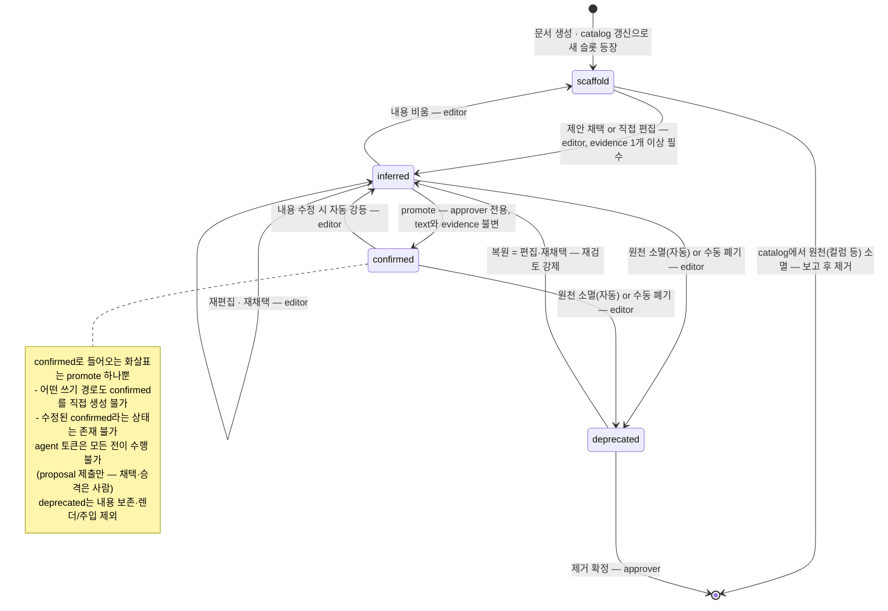

# agent-knowledge-governance — 설계 문서 (v0.4.7 초안)

> claude-hooks에 keyword-docs로 들어간 **도메인 지식 코퍼스**(db-schema · msg-format ·
> domain-aware-skill)를 독립 레포로 분리하고, **서버에 올려 여러 사람이 대시보드에서
> 열람·수정·승격**할 수 있게 하는 시스템의 설계도.
>
> 작성: 2026-07-17. 근거 코드는 claude-hooks(= github.com/ollybaysion/agentic-claude-hooks)
> 현 main 기준 file:line으로 인용.
> v0.2 개정(같은 날, 사용자 결정): 한 레포 풀스택 확정, 운영 DB(SQLite) 제거 —
> proposal 큐·감사까지 git+파일로, 주입에 B모드(허브 API fetch) 추가.
> v0.3 개정(같은 날): precision 폐지 → 키워드별 `inject` enum(§5 공통 봉투),
> 포맷 표준 = JSON Schema 파일 진실원(§5.0), confidence 상태 전이 다이어그램
> 명세화(D4), B모드를 지연 캐시 + 조건부 GET으로 정밀화(§8.3).
> v0.4 개정(2026-07-18): 다중 사용자 동시 접근 전제의 적대적 보안·동시성 검증
> 반영 — §11 신설(규칙 S1~S15), 인증 fail-closed 전환(D6), 바인딩 규율(D7),
> promote/adopt에 If-Match(§6), 충돌 판정 슬롯 단위화(D2). 열린 질문은 §12로 이동.
> v0.4.1 개정(같은 날): 용어 개명 — 티어 셀 → **티어드 값(tiered-value)**,
> queries/rejects의 인라인 티어 필드 폐지(중첩 통일). 정본·상세는 json-spec v0.2.
> v0.4.2 개정(같은 날): §0 성격 규정(도메인 지식 SSoT 관리 툴) 추가.
> 지식 반구 재정의(팩트 vs 슬롯)는 json-spec v0.2.2 §1.2.
> v0.4.3 개정(같은 날): 시스템명 확정 — agent-doc-hub →
> **agent-knowledge-governance**(약칭 akg, §12-1 해소). dochub CLI → akg CLI,
> 미러 = `~/.claude/akg/`, 토큰 = AKG_TOKEN. "허브"는 서버 역할 관용어로 유지.
> §0에 핵심 용어 온톨로지 블록(문서 = 팩트 + 슬롯, 티어드 값) 추가.
> v0.4.4 개정(같은 날): msg-format v1 범위 축소 반영(§5.2 — response·rejects
> 제외, 정본 json-spec v0.3).
> v0.4.5 개정(2026-07-19): 티어 4번째 상태 **deprecated** 반영(D4 상태도·§6
> deprecate API·§7 대기열 — 정본 json-spec v0.4). 고아 슬롯 = 자동 deprecate로
> 형식화. msg-format errorCodes도 추가 제외(§5.2).
> v0.4.6 개정(같은 날, 사용자 결정): 서버 프레임워크 **Fastify 확정**(D7 —
> raw http 기각. 근거: ajv 검증의 라우트 통합 + S1~S15 횡단 규율의 훅 체인
> 일원화, fdc-agent-be 사내 반입 실적).
> v0.4.7 개정(같은 날, 사용자 결정): **domain-skill spec.json 포맷 진실원의
> akg 이관 확정**(§5.3, §12-2 해소) — 발효 시점: foundry 세션의 spec 검증
> 완료분이 akg `schemas/domain-skill/v1.schema.json`으로 반영되는 순간부터.
> 이후 foundry validateSpec·renderSkill은 akg 스키마의 추종자(계약 방향 역전).
> db-schema-docs 포맷 소유자를 claude-hooks로 이관한 것과 같은 패턴.

---

## 0. 한 줄 요약

**지식의 저작·검토·승격·배포는 새 레포(허브 서버)로 옮기고, 주입(injection)은
claude-hooks에 남긴 채 로컬 미러를 읽되, 선택적으로 허브 API에서 신선본을 당긴다.**
문서의 진실원은 타입별 JSON으로 바꾸고, md는 결정적 렌더 산출물로 강등한다
(`render(json) === md`, foundry 골든 방식).

허브는 **한 레포 풀스택**(서버+대시보드+CLI)이며 **운영 DB가 없다** — 상태는 전부
git 저장소와 파일(사용자 결정 2026-07-17). 기능은 본질적으로 둘이다:
**① 정적 문서의 대시보드화**(열람·편집·검토·승격) **② JSON → md 컴파일**.

성격을 한 단어로 규정하면 **도메인 지식의 SSoT(single source of truth) 관리
툴**이다(사용자 규정 2026-07-18). 일반 위키·문서관리툴과의 차이 셋: ① 최종
소비자가 사람이 아니라 AI 에이전트(키워드 주입 파이프라인), ② 신뢰도
거버넌스(팩트/슬롯 구분·티어드 값·승격 관문 — json-spec §1.2), ③ 파생물의
결정성(`render(json) === md` CI 강제).

### 핵심 용어 — 지식 온톨로지 (정본: json-spec §1.2·§3)

```text
도메인 지식 ⊃ 문서 (SSoT 관리 단위 — 대상 하나: 테이블·커맨드·용어·절차)
              ├─ 팩트  (기계 지식 — 원천과 "대조"로 검증, 티어 없음·신선도만)
              └─ 슬롯  (사람 지식의 자리 — 사람의 "검토"로 검증)
                   └─ 티어드 값 {text, tier, evidence, by, at}
```

- **문서**: 팩트+슬롯을 포괄하는 상위 단위이자 SSoT의 관리 단위.
- **팩트**: catalog·행의 기계 필드처럼 DB·코드·실행과 대조하면 참/거짓이
  결정되는 정보. 틀리면 고치면 끝이라 신뢰 등급이 성립하지 않는다.
- **슬롯**: 사람의 해석이 위치하는 자리(설계 개념 — md 시절 "채울 자리"의
  형식화). 주소는 body 루트 기준 FQN형 경로(`purpose`, `columnDescs.USE_YN`,
  `queries[0].note`). 검증이 대조가 아닌 검토라서 **티어는 슬롯에만 있다**.
- **티어드 값(tiered-value)**: 슬롯에 오는 값의 공통 구조. scaffold → inferred →
  confirmed 전이(D4), confirmed 진입 경로는 promote 하나뿐. 폐기 상태
  **deprecated**(신뢰 철회 — 렌더·주입 제외, 복원은 inferred 경유)까지 4상태.

---

## 1. 목표와 비목표

### 목표

1. **분리**: keyword-docs 코퍼스 관리 기능을 claude-hooks에서 떼어 독립 레포로.
   사내 이관 전제(agent-skill-foundry와 같은 프라이빗 트랙).
2. **공동 편집**: 서버에 올려 여러 사람이 접근. 대시보드에서 3종 문서를
   보고 → 수정하고 → 판단을 거쳐 **승격**(scaffold → 추정 → confirmed).
3. **정형화**: md 단일 관리에서 벗어나, 잘 정형화되는 정보(컬럼표, 메시지 필드표,
   스킬 절차)는 **JSON을 진실원**으로 관리. md는 뷰.
4. **주입 경로 무손상**: 기존 UserPromptSubmit 키워드 주입은 현행 그대로 동작해야
   한다. 오프라인·fail-open 규율 유지 (프롬프트마다 서버 HTTP 왕복 금지).

### 비목표

- 실시간 동시 편집(CRDT/OT). 낙관적 잠금(rev 기반 409)으로 충분 — 사내 소수 인원.
- 범용 위키. 타입 스키마가 있는 도메인 지식 + freeform md 소량만.
- 관측 수집기(observability) 통합. 허브는 자체 감사 로그를 가지며, 개인 수집기
  이벤트(SchemaDocApply 등)는 선택적 병행 발신으로 남긴다.

---

## 2. 현 상태 (분리 대상의 실측 지도)

### 2.1 주입 엔진 — 하나의 엔진, 4개 인스턴스

`makeKeywordDocsProvider` 팩토리 하나(`core/context/lib/providers/keyword-docs.mjs:87`)를
4개 인스턴스가 공유. 포맷 차이는 없고 id·우선순위·기본 인덱스만 다르다:

| 인스턴스 | 우선순위 | 기본 인덱스 | 용도 |
| --- | --- | --- | --- |
| msg-format | 65 | `.claude/context-docs.msg-format.json` | 설비 커맨드 메시지 포맷 |
| db-schema | 60 | `.claude/context-docs.db-schema.json` | 테이블 스키마 문서 |
| domain-docs | 55 | `.claude/context-docs.domain.json` | 도메인 용어 |
| keyword-docs | 50 | `.claude/context-docs.json` | 범용 |

- 인덱스 = JSON 배열 `{keywords[], path, precision?}`. 레이어 3단(project > user > bundle),
  경로 해석은 `lib/doc-index.mjs`(대시보드 /docs와 **공유** — 주입과 열람 허용목록의
  단일 진실원, `server.mjs:35`).
- 매 턴 재독(리로드 불요), 세션 내 15분 dedup, 문서당 1200자 슬라이스, maxDocs 2,
  이벤트당 예산 1500자 (`budget.mjs:9-10`).
- 토크나이저는 ASCII 전용(`/[a-z0-9_]+/`) — 순한글 키워드는 매치 불가.

### 2.2 문서 포맷과 라이프사이클

- **db-schema md**: dbdoc 마커로 auto/manual 슬롯 분리. auto(컬럼표·PK·인덱스·관계)는
  `describe_table` JSON(agent-db-plugin MCP 계약)에서 재파생, manual(purpose·컬럼 설명·
  대표 쿼리)은 md에서 보존 병합 (`skills/db-schema-docs/render.mjs:137-166`).
  **즉 이미 반쯤 JSON이 진실원이다** — 구조는 JSON, 의미만 md.
- **3티어 신뢰도**: `{{scaffold}}` → `추정) 텍스트 [근거: file:line]` → confirmed(접두사 제거).
  구분자는 오직 `추정)`+공백 한 칸의 문자열 접두사 (`db-schema-apply/apply.mjs:35`).
- **단일 쓰기 게이트웨이**: 모든 생산자(propose-codebase, foundry 스킬, 전문가 구술)는
  proposal JSON을 내고 `db-schema-apply/cli.mjs`만 문서를 쓴다. apply는 inferred로만
  기록, confirmed는 절대 건드리지 않음. **승격은 사람 전용**.
- **msg-format / domain 문서**: 템플릿만 존재(`skills/keyword-docs-new-docs/templates/`),
  실 인스턴스 0건. 필드표·에러코드표 등 고도로 정형 — JSON화 최적 후보.
- **domain-aware-skill**: agent-skill-foundry의 산출물. **spec.json이 이미 진실원**이고
  `render(spec) === SKILL.md` 바이트 동일이 합격 기준 (`forge/render-skill.mjs`,
  `golden/fdc-explain-sensor/`). 값 해석 규칙(valueRules)의 근거(basis)에 티어가 인라인.

### 2.3 대시보드 (observability 서버 내 /docs)

- 뷰어(#92) + 검토 대기열 + **전체 승격 버튼(#90·#112, v0.21.0)까지 배포 완료**.
  `GET /docs`, `GET /docs/content`, `POST /actions/schema-docs/promote`(enrich CLI에 위임).
- **미구현으로 확인된 것**: ① 문서 본문 인라인 편집, ② 항목(슬롯)별 승격 UI(#115 방향),
  ③ project/bundle 레이어 열람, ④ 다중 사용자(루프백 전용, 인증 기본 OFF).
- 서버는 단일 파일 `core/observability/server.mjs`(~4,400줄), 루프백 바인드 강제,
  SQLite events.db. **개인용 관측기로 설계됨 — 다중 사용자 문서 서버로 확장하기엔
  부적합** (→ §4 결정 D7).

### 2.4 실데이터

- 살아있는 문서: `~/.claude/docs/db/` FDC 4개(전 슬롯 `추정)`, 승격 0), 인덱스는
  `~/.claude/context-docs.db-schema.json`뿐. msg-format·domain 인스턴스 0.
- **실증된 md 취약점**: 온디스크 4개 문서엔 구 렌더러가 찍은
  `## 마이그레이션 주의` 섹션이 남아 있는데, 이 슬롯은 ch PR #109에서 **의도적으로
  폐지**됐고 현 렌더러(0.40.0)는 모른다. 문제는 폐지 자체가 아니라 메커니즘 —
  지금 재생성하면 기존 문서의 그 절이 **경고 없이 유실**된다(의식적 폐기와 사고
  유실을 구분할 수 없음). "모르는 키 거부"가 있는 JSON 진실원이라면 이런 변화는
  스키마 버전 마이그레이션 단계에서 명시적으로 드러난다.

---

## 3. 아키텍처 개요

```text
┌────────────────────────── 사내 서버 ──────────────────────────┐
│  agent-knowledge-governance server (Node, 단일 프로세스)                     │
│                                                               │
│  ┌─ store/ (git 레포, 서버가 유일한 writer) ─────────────┐      │
│  │  db-schema/*.json      msg-format/*.json             │      │
│  │  domain-skill/*.spec.json   domain-doc/*.json        │      │
│  │  unclassified/*.md      proposals/<type>/*.json      │      │
│  │  rendered/<type>/*.md + index.json   (파생, 커밋됨)   │      │
│  └──────────────────────────────────────────────────────┘      │
│  users.json (토큰 해시·역할, 0600) ← 유일한 비-git 상태          │
│  REST API  +  대시보드 UI(/, /app.js — 기존 CSP 규율 승계)      │
└───────────────┬───────────────────────────────┬───────────────┘
                │ HTTPS (reverse proxy/SSO 뒤)   │
     사람: 브라우저에서 열람·편집·채택·승격        │
                                                │
┌─ 각자의 로컬 (CC 환경) ─────────────────────────▼───────────────┐
│  akg CLI:  sync(미러 당김) · propose(제안 푸시) ·             │
│               catalog-push(describe_table 갱신)                 │
│  ~/.claude/akg/<type>/{index.json, docs/*.md}   ← 미러=캐시   │
│  keyword-docs 프로바이더: 키워드 매치는 항상 미러 인덱스로,       │
│   A모드 = 미러 md 주입 (claude-hooks 무수정)                     │
│   B모드 = 매치 시 허브 API에서 신선본 fetch                      │
│           (하드 타임아웃, 실패 시 미러 폴백 — §8.3)              │
└───────────────────────────────────────────────────────────────┘
```

핵심 흐름 세 가지:

1. **읽기(주입)**: 키워드 매치는 항상 로컬 미러 인덱스. 본문은 A모드(미러 파일)
   또는 B모드(허브 API 신선본 — 매치 시에만, 타임아웃+미러 폴백, §8.3).
   서버가 죽어도 마지막 미러로 계속 동작하는 성질은 두 모드 공통.
2. **쓰기(저작)**: 사람은 대시보드에서 폼 편집, 에이전트는 proposal POST.
   모든 변이는 서버 API 한 곳을 통과(기존 "apply-cli 단일 게이트웨이"의 서버 승계).
3. **승격**: 대시보드 검토 대기열에서 슬롯 단위 채택/승격. approver 역할 + 감사 로그.

---

## 4. 핵심 설계 결정

### D1. 분리 경계 — 코퍼스는 이동, 주입기는 잔류

| 대상 | 어디로 | 근거 |
| --- | --- | --- |
| 문서 저장·스키마·렌더러 | **새 레포** | 진실원 소유 |
| enrich/apply/promote 엔진 | **새 레포** (서버 API로 승계) | 쓰기 게이트웨이가 곧 서버 |
| 대시보드 문서 탭(뷰·검토·승격) | **새 레포** (허브 대시보드로 재구현) | 다중 사용자 |
| 문서 저작 스킬(new-docs, db-schema-docs, propose, apply) | **새 레포** (허브 API 클라이언트로 개조) | 생산자도 게이트웨이를 봐야 |
| keyword-docs 주입 프로바이더 4종 + doc-index/ledger/stats | **claude-hooks 잔류** | CC 훅 런타임(hook-io)에 결합, 로컬 파일만 읽으면 됨 |
| add-index/prune 스킬 | 잔류 후 축소 | 키워드가 문서 필드로 이동하면(D5) add-index는 소멸, prune은 usage-stats 업로드로 대체 후보 |

Phase 1(A모드·미러)에서는 **claude-hooks를 한 줄도 고치지 않는다**. 프로바이더의 user 레이어
인덱스는 `~/.claude/context.json`의 `params.index`로 재지정 가능하고
(`keyword-docs.mjs:96-119`), 문서 경로는 인덱스 파일 위치 기준으로 해석되므로
(`doc-index.mjs:24-27` — 폴더명이 `.claude`가 아니면 그 폴더가 base), 미러 디렉토리는
자기완결이다. 설정 4줄로 전환 완료:

```jsonc
// ~/.claude/context.json (발췌)
{ "providers": { "db-schema":  { "params": { "index": "~/.claude/akg/db-schema/index.json" } },
                 "msg-format": { "params": { "index": "~/.claude/akg/msg-format/index.json" } },
                 "domain-docs":{ "params": { "index": "~/.claude/akg/domain/index.json" } } } }
```

B모드(허브 fetch 주입, §8.3)는 keyword-docs 엔진에 `hub` 파라미터를 더하는
claude-hooks 쪽 소규모 확장이 필요하다 — 잔류 결정과 모순되지 않으며(엔진
소유자가 자기 엔진을 확장), 별도 claude-hooks 이슈로 진행한다(Phase 3).

장기(Phase 4 선택지): 프로바이더 자체를 새 레포의 CC 플러그인으로 옮겨 완전 독립.
엔진은 ~300줄(keyword-docs.mjs + doc-index.mjs)이라 이전 비용은 작지만, claude-hooks
사용자 전체의 마이그레이션이 걸리므로 사내 이관 시점에 재판단.

### D2. 저장소 — git 레포가 전부, 운영 DB 없음

- 문서는 **평문 파일**(JSON/md)로 서버의 git 레포(`store/`)에 산다. 모든 변이는
  API 핸들러 → 쓰기 큐(직렬화) → 파일 수정 → `git commit --author "이름 <메일>"`
  1커밋. 단일 프로세스 + 직렬 쓰기 큐라 머지 충돌이 원천 부재.
- **proposal 큐도 git 안**: 제출 = `store/proposals/<type>/<id>/<uuid>.json` 커밋,
  채택 = 문서 반영 + 제안 파일 archive/ 이동이 한 커밋(원자적), 기각 = 사유를
  담아 이동. 검토 대기열 = 디렉토리 나열. 재시작에도 살아남고 diff로 읽힌다.
- **감사 = git 이력 그 자체**: 커밋의 author/시각/경로/메시지가 곧 감사 행.
  `GET /api/audit`는 `git log` 파싱으로 구현 — 사내 규모(수백~수천 커밋)에서 충분.
- **유일한 비-git 상태 = `users.json`**(서버 로컬, 0600): 사용자별 토큰 sha256
  해시 + 역할. 관리 CLI로 발급/회수. 시크릿이므로 git에 넣지 않는다.
- (Phase 4 선택) 주입 usage-stats는 JSONL append 파일 — 그때도 DB는 불필요.
- 얻는 것: 변경 이력·diff·blame 공짜, 백업 = 사내 GitHub private remote push,
  미러 동기화의 자연스러운 etag(HEAD 커밋 해시), 재해 복구 = clone,
  **DB 스키마 마이그레이션 없는 운영**.
- 동시 편집 충돌: 문서별 `rev`(해당 파일 최종 커밋 해시)를 ETag로. `PUT`은
  `If-Match` 필수, 불일치 → 409 + 서버 최신본 반환 → 클라이언트 재편집.
  단 409 판정은 **슬롯 단위**(겹치지 않는 슬롯 편집은 서버가 자동 재베이스,
  §11 S6), rev 재검증은 쓰기 큐 워커 안 커밋 직전에 수행한다(TOCTOU 차단,
  §11 S5). rev 계산은 인메모리 path→rev 캐시로(§11 S10).

초안 v0.1은 SQLite를 보조로 뒀으나 **제거했다(사용자 결정 2026-07-17)**: 단일
writer가 쓰기를 직렬화하는 순간 DB가 제공하던 것(트랜잭션·큐·이력)은 전부
git+파일로 환원되고, 남는 건 운영 부담뿐이다. DB-as-truth(문서를 DB에 저장)는
처음부터 기각 — 이력·백업·미러를 전부 자작해야 하고 "파일이 진실" 규율(#92)과
어긋난다. git 의존성(서버에 git 바이너리)은 사내 서버에서 문제가 아니다.

### D3. 문서 모델 — 타입별 JSON 진실원 + 결정적 md 렌더

사용자 방향("정형화되는 정보는 JSON") 채택. foundry에서 검증된 패턴을 전 타입으로:

- 진실원 = `store/<type>/<id>.json`. 타입 스키마로 검증하며 **모르는 키는 거부**
  (`forge/render-skill.mjs:52-58` 방식) — §2.4의 마이그레이션 섹션 유실류 버그를
  구조적으로 차단.
- md = `render(json)`의 결정적 산출물. 쓰기 때 서버가 렌더해서 `rendered/`에 함께
  커밋(사람이 git diff로 읽는 뷰 + 미러/주입이 소비하는 실물). 골든 테스트:
  기존 4개 FDC 문서에 대해 `render(migrate(현 md)) === 현 md` 바이트 동일
  (폐지 슬롯 처리 별도, §9.1).
- 프로즈는 JSON 안의 문자열 필드로 산다(정형의 반대가 아님). unclassified 타입만 md 원본 유지.

### D4. 신뢰도 티어의 구조화 — 접두사 문자열에서 필드로

현행은 `추정)` 접두사(+공백)가 유일한 구분자다(파싱 취약, 항목별 조작 어려움). JSON
모델에서 의미 슬롯은 전부 공통 티어드 값(tiered-value) 타입으로:

```jsonc
{ "text": "센서 사용 여부('Y'=활성)",
  "tier": "inferred",              // scaffold | inferred | confirmed | deprecated
  "evidence": ["fdc-app/src/schema-map.ts:72"],
  "by": "agent:propose-codebase",  // 마지막 변경 주체 (감사와 별개의 요약)
  "at": "2026-07-17T05:00:00Z" }
```

- 렌더러가 티어를 표기로 되돌린다: scaffold → `{{설명}}`, inferred → `추정) … [근거: …]`,
  confirmed → 본문 + `[근거: …]`, deprecated → **렌더 제외**(낡은 지식의 주입
  방지 — 대시보드·API 전용). **주입되는 md는 현행과 동일하게 생겼다** —
  CC가 읽는 신뢰도 신호 규약은 불변.
- 불변 규칙 승계: 에이전트 경로(proposal 채택)는 inferred까지만 쓴다. confirmed로의
  전이는 approver의 promote API만 가능. confirmed 슬롯은 apply가 건드리지 않는다.
- 승격 단위가 자연스럽게 **슬롯 단위**가 된다(#115가 원하던 항목별 채택/승격).

슬롯의 전 생애 상태 전이 — **이 다이어그램이 곧 서버 쓰기 검증의 사양**이며,
화살표에 없는 전이는 API가 400/403으로 거부한다:



inferred·confirmed 슬롯의 원천이 catalog에서 사라지는 경우(컬럼 drop)는 자동
제거하지 않는다 — 사람이 남긴 의미가 걸려 있으므로 서버가 **deprecated로 자동
전이**(= 고아 슬롯)해 검토 대기열에 올리고, 사람이 제거를 확정(approver)하거나
복원(편집 → inferred)한다(§2.4 md 시절 "무경고 유실"의 정반대 동작). editor가
낡은 지식을 수동 폐기하는 경로도 같은 상태를 쓴다 — 상세 정본은 json-spec §3.1.

### D5. 키워드는 문서의 소유 — 인덱스는 파생물

현행은 인덱스 파일과 문서가 분리돼 add-index 스킬이 3레이어 충돌 검사를 손으로
한다. 허브에서는 `keywords[]`(키워드별 `inject` 포함)가 **문서 JSON의 필드**가 되고, 타입별
`index.json`(프로바이더가 읽는 기존 포맷 그대로)은 서버가 쓰기 시점에 재생성한다.

- 충돌 검증(동일 타입 내 키워드 중복, 타 타입과의 섀도잉 경고)은 서버의 쓰기 검증으로
  이동 — 스킬의 수작업 대조가 사라진다.
- ASCII 소문자 강제, 과대 키워드 경고(현 add-index 스킬의 규칙)를 서버 검증으로 승계.

### D6. 권한 — 3역할 + 사람만 승격

| 역할 | 할 수 있는 것 |
| --- | --- |
| **viewer** | 열람, 미러 sync |
| **editor** | 문서 생성·수정(결과는 inferred 이하), proposal 채택/기각 |
| **approver** | + 슬롯/문서 승격(confirmed), 삭제(아카이브) |
| (agent 토큰) | proposal 제출과 catalog-push만. 문서 직접 쓰기 불가 |

- 인증: 사용자별 bearer 토큰(관리 CLI로 발급, `users.json`에 sha256 해시로 저장,
  비교는 obs 서버의 timingSafeEqual 패턴 승계). 단 **기본값은 obs와 정반대의
  fail-closed**(§11 S1): users.json이 없거나 비어 있으면 기동 거부, 유효 토큰
  없는 쓰기는 무조건 401 — "토큰 미설정 = 인증 OFF"를 승계하지 않는다. 토큰은
  만료·회수·시도 제한을 가진다(§11 S14). 사내 배포는 HTTPS reverse proxy 뒤,
  SSO 도입 시 `X-Forwarded-User` 신뢰 모드 추가 — 앱이 클라이언트발
  `X-Forwarded-*`를 항상 덮어쓰고 프록시 우회 접속이 불가능한 바인딩(§11 S2)이 전제.
- "승격 = 사람"의 기술적 강제: agent 토큰에는 promote/PUT 권한 자체가 없다.
  editor가 직접 편집한 프로즈도 inferred로 저장 — confirmed는 오직 promote 액션.
- 감사: 모든 변이 = git 커밋(author) + audit 행(actor, action, doc, slot, before/after 요약).

### D7. 새 서버 (관측 수집기 확장 아님)

observability 서버는 개인용(루프백 강제, 인증 OFF, 단일 파일 4,400줄, events.db와
동거)이라 다중 사용자 문서 서버로 키우면 양쪽 다 나빠진다. 허브는 **새 레포의 작은
서버**로 시작한다:

- **한 레포 풀스택**: 서버(API)·프론트(정적 대시보드)·CLI가 한 레포. 프론트는
  서버가 서빙하는 바닐라 JS(`/app.js`)로 빌드 스텝 없음. Node LTS, 프레임워크는
  **Fastify 확정**(사용자 결정 2026-07-19; raw http 기각 — ajv 검증을 라우트
  선언에 통합할 수 있고, 인증 fail-closed·If-Match 등 횡단 규율(S1~S15)을
  onRequest 훅 체인 한 곳에서 강제. fdc-agent-be로 사내 반입 실적). DB 없음(D2)
  이라 외부 의존은 사실상 프레임워크 하나가 전부.
- 대시보드 규율은 obs에서 승계: 엄격 CSP(`script-src 'self'`, JS는 `/app.js` 분리
  서빙), 값은 전부 textContent, fail-soft(깨진 문서가 500을 내지 않음).
- **바인딩 규율은 obs에서 승계하지 않는다**(§11 S2): obs의 "루프백이면 신뢰"는
  다중 사용자 네트워크 노출에선 성립 불가. 앱은 루프백/유닉스 소켓에만 바인드하고
  외부 노출은 동일 호스트 리버스 프록시가 전담(내부망에서 앱 포트 직접 접속 차단).
- 기존 obs 대시보드의 keyword-docs 탭은 허브 배포 후 "허브로 가기" 링크로 축소
  (Phase 3에서 정리).

---

## 5. 데이터 모델 — 타입 스키마 초안

### 5.0 포맷 표준의 관리 — JSON Schema 파일이 진실원

타입 스키마는 산문이나 검증기 코드가 아니라 **레포 안의 JSON Schema 파일**
(draft 2020-12)로 관리한다:

```text
schemas/
  common/tiered-value.v1.schema.json    # 티어드 값 공통 타입 — 각 타입이 $ref로 참조
  db-schema/v1.schema.json           # 전 층위 additionalProperties:false = 모르는 키 거부
  msg-format/v1.schema.json
  domain-skill/v1.schema.json        # spec.json 포맷 진실원(이관 발효 후 — §5.3)
  unclassified/v1.schema.json        # 타입 분류 밖 md 문서의 사이드카 메타
```

- **소비자 셋이 같은 파일 하나를 읽는다**: ① 서버 쓰기 검증(ajv 호출 한 줄)
  ② 대시보드 폼 생성(§7 — 어떤 필드가 티어드 값인지, enum·필수 여부를 스키마에서
  파생) ③ 외부 도구·에디터(`GET /api/schemas/:type`으로 서빙). foundry는
  "검증기 코드 + schema.json = 진실원 2개"라며 수제 검증기를 택했지만, 거긴
  소비자가 렌더러 하나였다 — 여긴 소비자가 셋이라 반대로 **선언적 스키마 파일
  1개**가 진실원 1개고, 검증기를 손으로 쓰는 쪽이 이원화다.
- **버전 규칙**: 문서마다 `"schema": "<type>/v<N>"`이 박힌다. 기존 문서를 깨는
  변경(필드 제거·의미 변경·필수화)은 **새 vN 파일 + 마이그레이터 동반 강제** —
  기존 문서 전건이 스키마를 통과하는지 CI 골든 테스트가 지키므로, 마이그레이터
  없는 파괴적 스키마 변경은 머지가 안 된다. 선택 필드 추가만 같은 버전에서 허용.
- **스키마 변경도 PR로**: `schemas/`는 코드다. v0.1의 "수제 검증기" 결정은 이
  절로 대체한다.
- 서버는 모르는 `schema` 버전의 쓰기를 거부한다(구버전 읽기는 허용, 쓰기 전
  마이그레이션 요구 — `akg migrate` 배치가 일괄 승격).

### 공통 봉투 (모든 타입)

```jsonc
{ "schema": "db-schema/v1",        // §5.0의 JSON Schema를 가리킴
  "id": "testuser.fdc_sensor",     // 타입 내 유일 = 파일명
  "keywords": [                    // 주입 트리거 — 키워드마다 주입 형태를 따로 가짐
    { "kw": "testuser.fdc_sensor", "inject": "full" },
    { "kw": "fdc_sensor",          "inject": "full" },
    { "kw": "sensor",              "inject": "pointer" }   // 광범위 키워드는 포인터만
  ],
  "status": "active",              // active | archived
  "body": { ... 타입별 ... } }
```

**precision 재설계(v0.3)**: 현행 인덱스의 `precision`(1=본문, 0.5=포인터)은
이름이 모호하고 **문서 단위**라는 게 결함이다 — 이 값이 실제로 표현하는 건 "이
키워드가 이 문서를 얼마나 정확히 지목하는가"라는 **키워드→문서 관계의 속성**이라,
같은 문서라도 `testuser.fdc_sensor`(정확)와 `sensor`(광범위)는 달라야 한다. 허브
스키마에서는 키워드별 `inject: "full" | "pointer"` enum으로 옮긴다(식별자형 =
full, 일반어 = pointer — 서버가 광범위 키워드 등록 시 pointer를 제안). 프로바이더
계약은 그대로다: 서버가 index.json 컴파일 때 같은 문서를 **full 키워드 엔트리
(precision 1, 앞순서)와 pointer 키워드 엔트리(precision 0.5, 뒷순서) 둘로 분리
방출**하면, 기존 엔진의 스캔 순서·seenPath dedup과 그대로 맞물린다 — 정확
키워드에 걸리면 본문, 광범위 키워드에만 걸리면 포인터.

### 5.1 db-schema/v1

```jsonc
"body": {
  "owner": "TESTUSER", "table": "FDC_SENSOR",
  "catalog": {                     // auto — describe_table JSON 사본, catalog-push로만 갱신
    "columns": [{ "name": "SNSR_ID", "type": "VARCHAR2(30)", "nullable": false,
                  "default": null, "comment": "센서 ID" }],
    "primaryKey": ["SNSR_ID"], "foreignKeys": [...], "indexes": [...],
    "numRows": 120, "lastAnalyzed": "...", "fetchedAt": "...", "tableComment": "..." },
  "purpose":  { /* 티어드 값(D4) */ },
  "columnDescs": { "SNSR_ID": { /* 티어드 값 */ } },   // catalog.columns와 이름으로 조인
  "queries":  [{ "sql": "...", "source": "representative-queries",
                 "note": { /* 티어드 값 */ } }] }
```

렌더는 현 `render.mjs` 출력과 동일 구조(H1 → purpose → 컬럼표 → 키 → 대표 쿼리).
"마이그레이션 주의" 슬롯은 ch PR #109의 폐지 결정을 존중해 스키마에 넣지 않는다 —
기존 문서에 잔존하는 내용의 처리는 §9.1. **catalog와 columnDescs의 분리가 곧
auto/manual 분리** — 재생성 병합 로직(extractRegion/extractColumnDescriptions)이
통째로 불필요해진다.

### 5.2 msg-format/v1

```jsonc
"body": {
  "command": "CMD_START_LOT", "direction": "host->equipment",
  "purpose": { /* 티어드 값 */ },
  "fields": [{ "seq": 1, "name": "LOT_ID", "type": "string", "required": true,
               "desc": { /* 티어드 값 */ } }],
  "examples": [{ "label": "정상", "payload": "{...}" }] }
```

현 템플릿(`templates/msg-format.md`)의 슬롯을 스키마화하되 **v1 범위는 축소** —
`response`·`rejects`·`errorCodes`는 당장 불필요 판단으로 제외(사용자 결정
2026-07-18, 정본 json-spec v0.4; 재도입은 동일 버전 선택 필드 추가로 가능).
v1 body = command·direction·purpose·fields·examples. 필드표는 가장 정형적인
데이터라 JSON 이득이 최대(대시보드에서 행 단위 폼 편집·행 단위 승격).

### 5.3 domain-skill/v1 (domain-aware-skill)

- `body` = foundry spec(name, argumentHint, description, h1Title, intro, steps[],
  valueRules[], output, discipline?). **포맷 진실원 = akg**(사용자 결정 2026-07-19,
  v0.4.7): 발효 시점은 foundry 세션의 spec 검증 완료분이 akg
  `schemas/domain-skill/v1.schema.json`으로 반영되는 순간부터 — 그 전까지는
  현행대로 foundry 계약을 무변형 수용(스펙 §4.4의 v0.4.1 정정이 그 예).
  발효 후에는 foundry `validateSpec`이 akg 스키마의 추종자다(계약 방향 역전 —
  골든 테스트가 양방향 어긋남을 잡는 건 동일).
- 렌더러는 `renderSkill()` 바이트 동일 출력 — 허브가 SKILL.md를 찍는다. 정본
  렌더러도 이관 발효 후 akg 소유, foundry는 재사용/추종.
- v1에서는 valueRules의 티어가 basis 문자열 인라인(현 foundry 규약)임을 그대로 둔다.
  구조화 티어로의 spec v2는 **akg가 발행**하고 foundry가 따라온다(§12-2 프레임
  해소 — "동조 협상"이 아니라 소유자의 버전 발행). 허브는 `schema` 필드로
  v1/v2를 공존시킬 수 있다.
- 배포: `akg sync`가 confirmed 상태의 스킬을 `~/.claude/skills/<name>/SKILL.md`로
  렌더 설치(선택 플래그). 검토 중(inferred 슬롯 잔존) 스킬은 기본 미설치.

### 5.4 domain-doc/v1 (용어 문서 — 사용자 명명 3종엔 없지만 제품에 이미 있는 가족)

`templates/domain.md`의 슬롯 그대로: `term`, `definition`(티어드 값), `behavior`,
`codeRefs[]`, `invariants[]`, `edgeCases`, `background`. domain-docs 프로바이더가
소비. domain-skill과 한 화면(도메인 탭)에서 관리하되 타입은 분리.

### 5.5 unclassified/v1

정형 타입 어디에도 분류되지 않는 문서의 도피 타입(이름이 곧 의미 — 초안의
freeform에서 개명, "형식 자유"가 아니라 "분류 밖"이 요지). md 원본 그대로
(`store/unclassified/*.md` + 사이드카 메타 JSON에 keywords·inject). 범용
keyword-docs 인스턴스용. 스키마 없음, 티어 없음, 편집은 textarea.

### 5.6 파생물 — 미러 번들 레이아웃

```text
~/.claude/akg/
  meta.json                  # 서버 URL, 마지막 sync rev(HEAD 해시), 시각
  db-schema/ { index.json, docs/*.md }
  msg-format/ { index.json, docs/*.md }
  domain/     { index.json, docs/*.md }        # domain-doc 렌더
  skills/<name>/SKILL.md                        # 선택 설치
```

index.json은 **현행 프로바이더 포맷 그대로**(`{keywords, path, precision}` 배열,
path는 `docs/<id>.md` 상대 경로) — 주입기 쪽 코드 수정 0. `precision`은 키워드별
`inject`에서 컴파일된다(full 묶음 = precision 1 엔트리 앞순서, pointer 묶음 =
0.5 엔트리 뒷순서 — §5 공통 봉투의 재설계 절 참조).

---

## 6. 서버 API 초안

| 메서드/경로 | 권한 | 설명 |
| --- | --- | --- |
| `GET /health` | 공개 | 버전, store HEAD rev |
| `GET /api/docs?type=&tier=&q=` | viewer | 목록 + 슬롯 티어 집계(검토 대기열의 데이터원) |
| `GET /api/docs/:type/:id` | viewer | `{json, md, rev, tiers}`; `?format=md`는 md 원문 + ETag(문서 rev), `If-None-Match` → 304(B모드 캐시 재검증) |
| `GET /api/index/:type` | viewer | 프로바이더 포맷 index.json(ETag = HEAD rev) — B모드 인덱스 갱신용 |
| `GET /api/schemas/:type` | 공개 | 해당 타입의 현행 JSON Schema(§5.0) — 대시보드 폼·외부 도구가 소비 |
| `POST /api/docs/:type` | editor | 생성(스키마 검증 + 키워드 충돌 검증) |
| `PUT /api/docs/:type/:id` | editor | 수정. `If-Match: rev` 필수, 프로즈 변경은 inferred로 강등 저장 |
| `PUT /api/docs/db-schema/:id/catalog` | editor·agent | describe_table JSON 반영(auto 슬롯만 교체, 의미 슬롯 불변) |
| `POST /api/docs/:type/:id/promote` | approver | body `{slots?: [...]}` — 슬롯 단위, 생략 시 전체. **`If-Match: rev` 필수**(§11 S4 — 검토한 그 내용만 승격) |
| `POST /api/docs/:type/:id/deprecate` | editor | body `{slots: [...], reason?}` — 폐기 표시(내용 보존, 렌더·주입 제외). `If-Match: rev` 필수. 복원 API는 없음 — 편집·재채택이 곧 복원(→ inferred) |
| `DELETE /api/docs/:type/:id` | approver | 아카이브(soft) |
| `POST /api/proposals` | agent·editor | 제안 제출(현 proposal JSON 스키마 + type/id 타깃) |
| `GET /api/proposals?state=pending` | editor | 검토 대기열 |
| `POST /api/proposals/:pid/adopt` | editor | 채택 → 해당 슬롯 inferred 기록(수정 후 채택 가능). `If-Match`(대상 문서 rev) + pending 확인·이동이 큐 안 원자적(§11 S8) |
| `POST /api/proposals/:pid/reject` | editor | 기각(사유 기록) |
| `GET /api/bundle?since=<rev>` | viewer | 미러 번들(tar.gz). `since`=HEAD면 304 |
| `GET /api/audit?doc=&window=` | viewer | 감사 로그 |
| `POST /api/stats/injections` | agent | (선택, Phase 4) 로컬 주입 스탯 업로드 → 중앙 prune |

쓰기 계열 전부: 검증 실패는 400+슬롯별 사유(제안 lint의 "조용한 드랍 금지" 승계),
성공 시 git 커밋 해시를 새 rev로 반환. dry-run은 `?dry=1`(기본 아님 — 서버 API는
확정 실행, dry-run 문화는 클라이언트 CLI 쪽에 유지). 쓰기 공통 규율(§11):
전 검증은 쓰기 큐 워커 안 커밋 직전(S5), 요청 본문 상한 512KB + 필드별
maxLength(S13), `id` 경로 화이트리스트(S11), 커밋 메시지에 유저 입력 무보간(S12).

---

## 7. 대시보드

기존 obs /docs 탭에서 검증된 것(티어 하이라이트, fail-soft, CSP 규율)을 승계하고
빈 곳 4개를 채운다.

1. **코퍼스 화면**(타입 탭: DB Schema · Msg Format · Domain): 문서 목록 +
   scaffold/추정/confirmed 카운트, `추정) 대기` 카드, 검색.
2. **문서 화면**: 좌 md 렌더(티어 색: scaffold 회색, inferred 앰버) / 우 편집 패널.
   편집은 **타입 스키마 기반 폼** — 프로즈 슬롯 textarea, 필드표·valueRules는 행
   편집기, catalog(auto) 영역은 읽기 전용 + "catalog-push로 갱신하세요" 안내.
   저장 시 If-Match, 409면 diff 보여주고 재적용.
3. **검토 대기열 화면**: ① pending proposals(에이전트 제안 — 채택/수정 후 채택/기각),
   ② inferred 슬롯 전체(문서 횡단) — **슬롯 단위 승격 버튼**(#115의 항목별 채택 실현),
   ③ deprecated 슬롯(고아·수동 폐기 — 제거 확정/복원 대기).
   근거(file:line) 나열, 근거 수 = 신뢰 신호.
4. **감사 화면**: 누가 언제 무엇을(채택/승격/편집), git rev 링크.

승격 버튼의 confirm 문구와 "버튼 = 사람" 불변식은 현 구현(#112) 그대로.

---

## 8. 로컬 소비 — 미러(A모드)와 허브 fetch(B모드)

### 8.1 akg CLI (공통)

새 레포가 배포하는 단일 CLI(스킬이 아니라 실행 파일 — CC 밖에서도 cron 가능):

- `akg sync [--skills]` — `GET /api/bundle?since=<로컬 rev>` → 미러 원자 교체
  (임시 디렉토리에 풀고 rename). 304면 no-op. 실패해도 기존 미러 유지(fail-open).
  트리거: 수동 / cron / SessionStart 훅에서 fire-and-forget(5초 타임아웃, obs-client 패턴).
- `akg propose <type>/<id> proposal.json` — 제안 푸시. 기존
  db-schema-propose-codebase 스킬은 산출한 proposal.json을 로컬 apply 대신 이걸로 넘기게 개조.
- `akg catalog-push <table> describe.json` — db-schema-docs 스킬의 새 출구:
  MCP `describe_table` 결과를 허브로. (스키마 문서 생성이 "로컬 md 쓰기"에서
  "허브 카탈로그 갱신"으로 바뀐다.)
- 토큰: `~/.claude/akg/token`(0600) 또는 `AKG_TOKEN`.

### 8.2 A모드 — 미러 주입 (기본, claude-hooks 무수정)

주입기(claude-hooks)는 §4 D1의 context.json 4줄 외 무변경. dedup·예산·매칭 전부
현행. 신선도는 sync 주기에 좌우(SessionStart 훅이면 세션 단위).

### 8.3 B모드 — 허브 fetch 주입 (신선도 우선, claude-hooks 소규모 확장)

로컬 sync 주기와 무관하게 매 주입이 서버 최신본을 반영하는 모드.
keyword-docs 엔진에 `hub` 파라미터를 추가하는 claude-hooks 쪽 확장(별도 이슈):

```jsonc
// ~/.claude/context.json (발췌)
{ "providers": { "db-schema": { "params": {
    "hub": { "url": "https://akg.internal", "type": "db-schema",
             "timeoutMs": 400, "indexTtlMs": 300000 } } } } }
```

동작 원칙 — **감지는 클라 룰베이스, 네트워크는 매치된 문서의 정확 요청만**:

1. **감지(룰베이스, 로컬)**: 키워드 매치는 기존 엔진의 로컬 매처(토크나이저 +
   word/exact/substring 규칙) 그대로, 대상은 미러의 index.json(수 KB). 인덱스만
   TTL(기본 5분) 지나면 백그라운드로 선제 갱신(`GET /api/index/:type`,
   ETag=HEAD rev, 논블로킹 — 이번 턴은 현 캐시로 진행). **문서 본문은 선제
   동기화하지 않는다.**
2. **fetch는 매치된 그 문서만**: 매치 시 `GET /api/docs/:type/:id?format=md`를
   하드 타임아웃(기본 400ms)으로 요청. 캐시된 사본이 있으면
   `If-None-Match: <캐시 rev>`를 실어 — 안 바뀌었으면 **304, 전송 0바이트로
   캐시 재사용**.
3. **성공 → 주입 + 캐시 저장(rev 동봉). 실패/타임아웃 → 캐시본 주입(폴백).
   캐시도 없으면 그 문서만 조용히 스킵**(fail-open). 대부분의 프롬프트는 매치가
   없으므로 네트워크 비용 자체가 0.
4. **pointer 키워드 매치도 fetch는 한다**: 포인터 주입은 "이 로컬 경로를 Read
   하라"는 한 줄인데, 지연 캐시에선 그 파일이 아직 없을 수 있다. 매치 시 주입은
   한 줄로 하되 본문 fetch로 캐시를 채워, 뒤이은 Read가 항상 성공하게 한다.

즉 B모드의 미러는 "선제 동기화 대상"이 아니라 **fetch가 채우는 지연 캐시**다 —
처음엔 비어 있어도 되고, 실제로 걸리는 문서만 로컬에 쌓인다. 오프라인 대비로
전체를 미리 받고 싶으면 `akg sync`를 곁들이면 된다(A모드와 동일 동작).
디렉토리 레이아웃은 §5.6과 동일 — 두 모드는 같은 미러를 공유하며 설정만으로
상호 전환 가능하다.

---

## 9. 마이그레이션 계획

### 9.1 데이터

1. `migrate-md` 일회성 도구: 현 FDC 4개 md → db-schema/v1 JSON. 마커
   (`dbdoc:auto/manual`)와 `추정)` 접두사, `[근거: …]`가 전부 기계 인식 가능하므로
   결정적 파싱. **인식 못 하는 잔존 영역은 소리 없이 버리지 않는다** — 폐지된
   `## 마이그레이션 주의` 절을 감지하면 보고하고, 내용의 수동 이전(purpose/queries)
   또는 의식적 폐기를 사람이 결정(→ §12).
2. 합격 기준(골든): `render(migrate(md)) === md` 바이트 동일(폐지된 마이그레이션
   절은 제외한 형태 기준). foundry Phase 1과 동일한 규율.
3. foundry golden spec(fdc-explain-sensor)을 domain-skill 타입의 시드 문서로 적재.

### 9.2 코드·운영 로드맵

| Phase | 내용 | 합격 기준 |
| --- | --- | --- |
| **0. 모델** | 레포 스캐폴드, 타입 스키마 4종 + 검증기(모르는 키 거부), 렌더러, migrate-md | 골든 3종: FDC md 왕복 바이트 동일 · foundry spec 렌더 바이트 동일 · msg-format 템플릿 예제 왕복 |
| **1. 서버+대시보드** | git store, 쓰기 큐, API(§6), users.json 토큰/역할, 대시보드 4화면(§7) | 두 계정 동시 편집: 겹치는 슬롯 → 409, 안 겹치면 자동 재베이스(S6); agent 토큰 promote → 403; promote If-Match 불일치 → 409(S4); users.json 없이 기동 → 거부(S1); 감사 뷰 == git log |
| **2. 소비 연결(A모드)** | akg sync + 미러, context.json 전환, 기존 4문서 주입 회귀 확인 | 서버 정지 상태에서 주입 정상(미러), sync 후 새 문서가 다음 턴 주입 |
| **3. 생산자 이전 + B모드** | propose→허브, catalog-push, keyword-docs hub-fetch 확장(claude-hooks 이슈), obs /docs 탭 축소(링크화), ch 쪽 apply/promote 스킬 deprecate | enrich 왕복(제안→채택→승격)이 대시보드에서 end-to-end; B모드 서버 다운 시 미러 폴백 실측 |
| **4. 선택** | 주입 스탯 업로드→중앙 prune 제안, 스킬 배포(sync --skills), 프로바이더의 플러그인 독립, 한글 키워드 매칭 개선 | — |

Phase 1까지는 로컬(개인 서버)에서 리허설 — agent-db-plugin 때의 "마켓플레이스
설치 경로 end-to-end 리허설" 관행 승계. 사내 이관은 foundry Phase 3와 같은 트랙.

---

## 10. 리스크와 완화

| 리스크 | 완화 |
| --- | --- |
| 서버 다운 시 지식 접근 불가 | 주입은 항상 로컬 미러(fail-open). 대시보드만 서버 의존 |
| JSON/md 불일치(이중 진실) | md는 항상 서버가 쓰기 시점에 렌더·커밋. CI에서 `render(json)===rendered/` 전건 검사 |
| 스키마 진화로 구 문서 깨짐 | 문서마다 `schema: "type/vN"`, 마이그레이터 동반 없는 스키마 변경 금지 |
| 티어 규율 우회(에이전트가 confirmed 사칭) | 서버에서 역할로 강제(agent 토큰에 promote 없음) — 문자열 규약이 아닌 권한 모델 |
| 키워드 충돌·과대 매칭의 중앙화 부작용 | 쓰기 검증(중복 거부·광범위 키워드 경고) + Phase 4 중앙 prune |
| Windows 클라이언트 경로(acp #24 재발 방지) | CLI 경로 처리에 처음부터 win32 테스트 |
| B모드 fetch가 프롬프트를 지연 | 매치 시에만 fetch(대부분의 프롬프트는 네트워크 0) + 하드 타임아웃 400ms + 미러 폴백; 인덱스 갱신은 백그라운드 |
| 감사를 git log 파싱에 의존 → 이력이 커지면 느려짐 | 사내 규모에선 무시 가능; 병목 시 인메모리 캐시(재기동 시 재구축)로 해결 — DB 재도입 없이 |
| 사내 이관 시 claude-hooks 결합 잔존 | 새 레포는 claude-hooks를 import하지 않는다. 접점은 ① 미러 index.json 포맷 ② context.json 설정 ③ B모드 hub API 계약 — 계약 테스트로 고정 |
| 인증 미설정 채로 배포돼도 겉보기 정상 동작 | fail-closed(§11 S1) — users.json 없으면 기동 자체를 거부, "조용히 무인증"인 상태가 존재하지 않음 |
| 문서 본문 = 전 사용자 CC 컨텍스트로 가는 프롬프트 주입 채널 | 검토 관문(채택·승격)이 유일한 실질 방어임을 명시 + confirmed-only 주입 옵션 + 광범위 full 키워드 승인제(§11 S3) |
| 에이전트 배치가 직렬 쓰기 큐를 점유해 전원 편집 대기(self-DoS) | 배치 1커밋 묶음 + 사람 쓰기 우선 2단 큐(§11 S7) |

---

## 11. 보안·동시성 — 적대적 검증 반영 (v0.4)

다중 사용자 동시 접근을 전제로 v0.3 설계를 적대적으로 검증한 결과(2026-07-18).
발견을 설계 규칙 **S1~S15**로 확정하고 관련 절(D2·D6·D7·§6·§10)에 반영했다.
치명 3건은 방향 자체를 못 박는 규칙, 동시성 6건은 다중 사용자 쓰기 규칙,
중간 6건은 구현 규율이다.

### 11.1 치명 — 설계 방향을 못 박는 3건

- **S1. 인증은 fail-closed(D6 반영)**: obs 서버는 토큰 미설정 시 인증이 꺼진 채
  동작한다(개인·루프백 전제라 거기선 타당). 허브가 이를 승계하면 배포에서
  users.json을 빠뜨린 순간 무인증 write·promote가 열린다. 규칙: **users.json
  없음/비어 있음 = 기동 거부**, 유효 토큰 없는 쓰기 = 무조건 401. "조용히 인증
  OFF"인 상태가 존재할 수 없어야 한다.
- **S2. 바인딩 규율(D7 반영)**: 네트워크에 노출되는 순간 obs의 "루프백이면 신뢰"
  모델은 무효다. 앱은 루프백/유닉스 소켓에만 바인드하고 외부 노출은 동일 호스트
  리버스 프록시가 전담(또는 앱 포트 방화벽). SSO의 `X-Forwarded-User`는 프록시
  우회가 가능하면 헤더 한 줄로 approver를 위조하는 수단이 되므로, 앱이
  클라이언트발 `X-Forwarded-*`를 항상 덮어쓰는 조건에서만 허용.
- **S3. 문서는 프롬프트 주입 배포 채널이다**: 이 시스템 고유의 공급망 위협.
  editor 1인(또는 탈취 토큰, 부주의한 채택)이 넣은 본문이 md 렌더 → 미러 동기화
  → 키워드 매치를 타고 **모든 사용자의 CC 컨텍스트에 그대로 주입**된다. 티어
  체계는 정확성 장치지 안전 장치가 아니다 — 인젝션을 전혀 막지 못한다. 완화:
  ① 검토 관문(채택·승격)이 유일한 실질 방어임을 리뷰 문화로 명시
  ② confirmed 슬롯만 주입하는 소비 측 옵션(기본값 여부는 §12-8)
  ③ 광범위 `inject: "full"` 키워드 등록은 approver 승인제(노출 면적 통제).

### 11.2 동시성 — 다중 사용자 쓰기 규칙 6건

- **S4. promote에도 `If-Match` 필수(§6 반영)**: 없으면 "리뷰어가 검토한 내용"과
  "승격되는 내용" 사이에 타인의 편집이 낄 수 있다 — 검토 안 된 텍스트가
  confirmed 도장을 받는 경로. 신뢰의 최종 관문이라 rev 가드가 가장 필요한 곳.
- **S5. 검증-커밋 원자성(TOCTOU 차단)**: If-Match·스키마·전이 검증을 API
  핸들러에서 하고 커밋만 큐에 넘기면 그 사이에 다른 쓰기가 낀다. **rev 재검증을
  포함한 전 검증은 쓰기 큐 워커 안, 커밋 직전에 수행**한다.
- **S6. 충돌 판정 단위는 슬롯**: rev는 파일 단위, 편집은 슬롯 단위 — 파일 단위
  409는 거짓 충돌을 양산한다(컬럼 많은 문서를 두 사람이 서로 다른 컬럼에서
  고치는 정상 시나리오가 전부 튕김). 규칙: If-Match 불일치 시 두 변경의 슬롯
  교집합을 보고 **겹치는 슬롯이 없으면 자동 재베이스 후 커밋**(응답에 재베이스
  사실 표기), 겹칠 때만 409.
- **S7. 큐 공정성**: 모든 변이가 한 직렬 큐를 지나므로 에이전트 배치
  (catalog-push 다건)가 전원의 편집을 막을 수 있다. 배치는 1커밋으로 묶고, 사람
  상호작용 쓰기가 배치보다 우선하는 2단 큐로 self-DoS를 차단.
- **S8. proposal 전이 원자성**: adopt/reject는 pending 파일의 존재 확인과 이동을
  큐 안에서 원자적으로 — 이중 채택은 나중 요청이 409. 에이전트의 동일 제안
  재제출은 내용 해시로 dedup.
- **S9. 단일 writer의 강제**: "서버만 store/를 쓴다"는 강제 수단 없인 가정일
  뿐이다(백업 cron의 `git gc`, 관리자 수동 git이 침범 후보). store/는 서버 계정
  전용 권한으로 격리, 수동 git 개입 금지를 운영 문서에 명기, 기동 시
  index.lock·더티 트리 검사 후 이상이면 기동 거부. 백업은 push 전용 remote로.

### 11.3 중간 — 구현 규율 6건

- **S10. rev 계산 캐시**: rev = `git log -1 -- <path>`는 이력 크기에 비례 —
  매 GET(ETag)·PUT마다 호출하면 이력 성장과 함께 전면 저하. 기동 시 1회 스캔으로
  path→rev 맵을 만들고 커밋마다 갱신(재기동 시 재구축).
- **S11. 경로 검증**: `id`는 파일명이 된다 — 화이트리스트(소문자·숫자·`_`·`.`·`-`,
  `..` 금지) + realpath가 store/ 안인지 확인. `akg sync`의 번들 추출도 동일
  규율(zip-slip: `../` 엔트리로 미러 밖 파일 쓰기 차단).
- **S12. 감사 인젝션 방지**: 커밋 메시지에 유저 입력을 그대로 보간하지 않는다 —
  구조화 포맷 + 개행·제어문자 제거, git 호출은 spawn 배열 인자(shell 경유 금지).
- **S13. 크기 상한**: 요청 본문 512KB, 프로즈 필드는 스키마 maxLength — 거대
  본문이 store·번들·주입 예산을 오염시키지 않게 쓰기 시점에 차단.
- **S14. 토큰 수명·시도 제한**: 토큰 만료(기본 90일)와 회수 CLI, 인증 실패
  레이트리밋(IP·토큰 단위). 클라이언트 보관은 환경변수보다 파일(0600) 권장 —
  환경변수는 프로세스 목록·크래시 덤프로 샐 수 있다.
- **S15. git 직접 편집 괴리**: API 우회 커밋은 티어드 값 `by`와 커밋 author를
  어긋나게 하고 단일 writer 불변식을 조용히 깬다 — S9의 경로 권한으로 차단하고,
  사내 이관 시 원격 미러에 pre-receive 검사를 선택 적용.

---

## 12. 열린 질문 (구현 착수 전 확정 필요)

1. **레포 이름 — 확정(2026-07-18)**: `agent-knowledge-governance`(약칭 **akg** —
   CLI·미러 디렉토리·토큰에 사용). 성격 규정(§0 SSoT+거버넌스)에 따른 사용자
   결정. 본문의 "허브"는 중앙 서버 역할을 가리키는 관용어로 유지한다.
2. **domain-skill 티어 구조화**(spec v2) — **프레임 해소(2026-07-19)**: 포맷
   진실원이 akg로 이관되므로(§5.3) "foundry와 동조"가 아니라 **akg가 v2를
   발행**하고 foundry가 추종. 남은 질문은 시점뿐(v1 인라인 유지로 출발 무방).
   v2 흡수 후보: valueRules 티어드 값 구조화, wiring/binds(+구조화 args).
3. **호스팅 형태**: 사내 서버 사양, HTTPS/리버스 프록시, SSO 유무. Phase 1 리허설은
   로컬로 충분하나 인증 모드(토큰 vs 프록시 헤더)는 초기에 갈래.
4. **generic keyword-docs(범용) 인스턴스의 편입 여부**: unclassified 타입으로
   허브에 넣을지, 개인 로컬 전용으로 남길지 (초안: 로컬 잔류, 허브는 3+1종만).
5. **obs 대시보드와의 관계**: 허브 배포 후 obs의 keyword-docs 탭·promote 엔드포인트
   제거 시점(주입 스탯 뷰는 obs에 남는 게 자연스러움).
6. **기존 문서의 `## 마이그레이션 주의` 잔존 내용**: migrate-md가 보고한 뒤 수동
   이전할지 폐기할지 — FDC 4개는 리허설 데이터라 폐기가 유력하나 사내 실 문서
   등장 전에 규칙 확정 필요.
7. **주입 기본 모드**: 팀 기본을 A(미러)로 둘지 B(hub-fetch)로 둘지, B모드
   기본치(타임아웃 400ms, 인덱스 TTL 5분)의 적정성 — 사내망 지연 실측 후 확정.
8. **confirmed-only 주입을 기본으로 할지**(§11 S3-②): 프롬프트 주입 노출 면적은
   최소가 되지만, 초기 코퍼스는 대부분 inferred라 기본 ON이면 주입이 빈약해진다 —
   코퍼스 성숙도를 보고 팀 단위로 전환하는 안이 유력.
