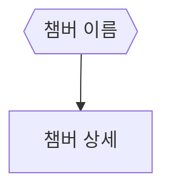

# 들어오는 간선 없는 변환

## 한 줄 설명

들어오는 간선 없는 변환 표본.

## 데이터


```mermaid
flowchart TD
  m{{챔버 이름}} --> ch_detail[챔버 상세]
```

### m — 챔버 이름

```map
ch = "C1"
```

### ch_detail — 챔버 상세

```sql
select ch, detail from fdc_chamber_detail where ch = :ch
```
