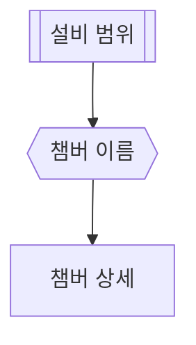

# 흘러들지 않는 이름

## 한 줄 설명

흘러들지 않는 이름 표본.

## 데이터


```mermaid
flowchart TD
  eqp-scope[[설비 범위]] --> m{{챔버 이름}}
  m --> ch_detail[챔버 상세]
```

### m — 챔버 이름

```map
ch = chamber_id
```

### ch_detail — 챔버 상세

```sql
select ch, detail from fdc_chamber_detail where ch = :ch
```
