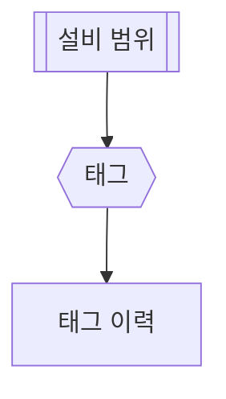

# 태그 붙이기

## 한 줄 설명

태그 붙이기 표본.

## 데이터


```mermaid
flowchart TD
  eqp-scope[[설비 범위]] --> to_tag{{태그}}
  to_tag --> tagged[태그 이력]
```

### to_tag — 태그

```map
tag = "E-" + eqp_id
```

### tagged — 태그 이력

```sql
select tag, act_time from fdc_tag_hist where tag = :tag
```
